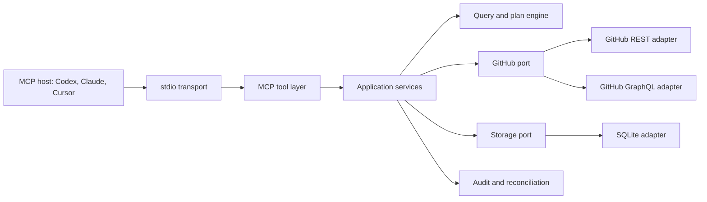

# GitHub Stars MCP: Product Requirements and Architecture

- Date: 2026-07-16
- Status: Ready for user review
- Repository: <https://github.com/90le/github-stars-mcp>
- Product name: GitHub Stars MCP
- Package candidate: `github-stars-mcp`

## 1. Decision summary

GitHub Stars MCP will be a local-first Model Context Protocol server for AI agents. Codex, Claude, Cursor, and other MCP clients will call structured tools to discover, inspect, organize, star, and unstar GitHub repositories. A thin Codex plugin will package the server configuration and agent workflow instructions.

The product will not ship a human-facing TUI or web application in version 1. The executable exists to run the MCP server and provide diagnostics. AI agents remain the primary interface.

Every GitHub mutation will follow this sequence:

```text
sync snapshot -> query evidence -> create immutable plan -> inspect plan -> apply plan -> record audit
```

The server will enforce a GitHub API allowlist. The code will contain no capability for deleting, archiving, transferring, renaming, changing visibility, or modifying the contents of a repository.

## 2. Problem

GitHub's web interface makes large Star collections slow to inspect and manage. Browser automation adds DOM latency and breaks when GitHub changes the page. Existing command-line tools focus on human interaction, omit Star Lists, request broad permissions, or expose generic GitHub operations that exceed the task.

AI agents need a purpose-built interface with five properties:

1. Structured, paginated results that fit model context windows.
2. API-speed access to Stars, repository metadata, search, and Star Lists.
3. Deterministic safety controls outside the model.
4. An immutable plan and audit trail for every mutation.
5. Local credential and data handling with no hosted service.

## 3. Product definition

GitHub Stars MCP is an agent tool server. It translates narrow MCP calls into official GitHub REST and GraphQL operations. It also maintains a local SQLite database for snapshots, plans, runs, and rollback data.

Version 1 is complete when a supported MCP client can:

- authenticate through an environment token or an existing `gh` login;
- synchronize a user's complete Star collection and Star Lists;
- filter Stars by objective repository properties;
- retrieve bounded evidence for subjective AI review;
- create and inspect a resolved change plan;
- star or unstar repositories through that plan;
- create, update, delete, and populate Star Lists through that plan;
- restore a previous run as far as GitHub's APIs permit;
- search GitHub for repositories and feed selected results into a change plan;
- install the optional Codex plugin and follow the same workflow;
- pass the documented test, security, packaging, and CI gates.

## 4. Product principles

### 4.1 Agent-first contracts

Each tool will accept validated JSON and return a concise text summary plus `structuredContent`. The server will paginate large result sets and expose totals before item details.

### 4.2 Safety in executable code

Tool descriptions and MCP annotations help an agent choose actions. They do not enforce safety. The GitHub adapter, plan engine, and database constraints will enforce the mutation boundary.

### 4.3 API-native execution

The server will use GitHub REST and GraphQL. It will not use browser cookies, DOM automation, or undocumented web requests.

### 4.4 Local privacy

The server will keep credentials in environment variables, the GitHub CLI credential store, or process memory. It will store repository metadata and audit records on the user's machine. Version 1 will send no telemetry.

### 4.5 Auditable and recoverable changes

The server will resolve selectors when it creates a plan. The apply step will execute those resolved targets, record before and after state, and refuse a changed or expired plan.

### 4.6 Portable distribution

The core package will run in any MCP host that supports local stdio servers. The Codex plugin will remain a distribution layer and will contain no business logic.

## 5. Users and use cases

### 5.1 Primary users

- Developers with hundreds or thousands of GitHub Stars.
- Researchers who use Stars and Lists as a knowledge base.
- AI-agent users who want routine collection maintenance without a browser.
- Teams that want a reviewed local tool before considering a hosted service.

### 5.2 Required use cases

1. "Show repositories below 10,000 stars that have not received a code push in three years."
2. "Review the ambiguous candidates and protect the ones with durable technical value."
3. "Unstar the remaining candidates and keep an audit record."
4. "Delete all Star Lists and retain enough state to recreate their names and memberships."
5. "Create topic-based Lists and assign selected repositories."
6. "Find maintained repositories about a subject, compare them, and star the selected set."
7. "Restore the changes from run X."

## 6. Version 1 scope

### 6.1 Included

- Local stdio MCP server.
- GitHub.com support.
- Environment token and GitHub CLI authentication.
- Capability detection for Stars and Star Lists.
- Complete Star and List snapshots.
- Structured query filters and sort orders.
- Bounded README evidence retrieval.
- Repository discovery through GitHub Search.
- Immutable change plans.
- Star, unstar, List CRUD, and List membership operations.
- Idempotent apply semantics and partial-run reconciliation.
- Audit history and rollback-plan generation.
- SQLite persistence and migrations.
- Codex plugin packaging with an MCP configuration and one workflow skill.
- Cross-platform tests for Windows, macOS, and Linux.
- npm package and GitHub release preparation.
- User, security, development, and troubleshooting documentation.

### 6.2 Excluded from version 1

- A TUI, web interface, or browser extension.
- A hosted multi-user service.
- Streamable HTTP transport and OAuth hosted callbacks.
- A built-in scheduler. The AI host or automation system owns scheduling.
- An embedded language model or paid recommendation service.
- Organization-wide shared collections.
- Guaranteed GitHub Enterprise Server support.
- Automatic npm publication without an authorized publisher account.

The architecture will keep transport, GitHub, and storage ports separate so later releases can add remote HTTP, OAuth, or another storage adapter.

## 7. Functional requirements

### 7.1 Authentication and capabilities

- **AUTH-01:** The server shall support `auto`, `env`, and `gh` authentication modes. `auto` shall resolve credentials in this order: `GITHUB_STARS_TOKEN`, `GITHUB_TOKEN`, `GH_TOKEN`, then `gh auth token --hostname <host>`.
- **AUTH-02:** The server shall use `execFile` or an equivalent non-shell subprocess API when it calls `gh`.
- **AUTH-03:** The server shall never return, log, persist, or include a token in an exception.
- **AUTH-04:** The server shall verify the authenticated login and GitHub host before it reads or writes data.
- **AUTH-05:** The server shall report Star read, Star write, User List read, and User List write capabilities separately as `available`, `unavailable`, or `unknown`. Capability checks shall not mutate GitHub; a write capability may remain `unknown` until an authorized apply proves or rejects it.
- **AUTH-06:** Missing List permissions shall disable List mutations without disabling Star reads.
- **AUTH-07:** The server shall bind every snapshot, plan, and run to a GitHub host and login.
- **AUTH-08:** The server shall treat fine-grained token support for User List mutations as capability-tested behavior because GitHub does not publish a complete permission mapping for those preview mutations.

### 7.2 Synchronization

- **SYNC-01:** A full sync shall enumerate every repository starred by the authenticated user through REST `GET /user/starred`. It shall not use GraphQL `starredRepositories` as the authority because that connection can report `isOverLimit`.
- **SYNC-02:** A sync shall collect the star timestamp, repository identifiers, owner/name, description, URL, star count, fork state, archived state, visibility, primary language, topics, license, `pushed_at`, and `updated_at` when GitHub supplies them.
- **SYNC-03:** A sync shall enumerate every User List and its complete membership when the capability exists. Every snapshot shall record List coverage as `collecting`, `complete`, `unavailable`, or `omitted`; `collecting` may publish only as `complete`, while `unavailable` and `omitted` shall contain zero List rows and shall never be represented as an empty complete collection. An unsupported union member or mid-collection capability failure shall fail the snapshot rather than publish partial coverage. The adapter shall isolate this public-preview schema from the domain layer.
- **SYNC-04:** The server shall write one immutable snapshot only after it receives all required pages and database-backed, order-independent exact set comparison of a second complete enumeration proves that the Star set and, when collected, every normalized List metadata field and membership did not change during collection. Final Star verification shall occur after all List work.
- **SYNC-05:** An interrupted sync shall remain incomplete and shall never become the latest usable snapshot.
- **SYNC-06:** Incremental mode shall enumerate the current Star set but may reuse repository metadata that remains fresh.
- **SYNC-07:** The result shall include counts, warnings, API rate-limit state, duration, and the snapshot ID.
- **SYNC-08:** A database lease with periodic heartbeat shall prevent two local server processes from publishing overlapping sync snapshots. Snapshot creation and publication shall bind the lease owner to the snapshot, and final count verification, active-lease verification using a fresh time, and `building -> complete` publication shall occur in one write transaction. Losing the lease shall stop new remote work. Startup recovery shall not fail work whose stored lease is still active.
- **SYNC-09:** The server shall store and return GitHub numeric IDs as decimal strings and GraphQL node IDs as strings.

### 7.3 Query and evidence

- **QUERY-01:** The server shall query an explicit snapshot or the latest complete snapshot.
- **QUERY-02:** Filters shall use a validated expression tree with `all`, `any`, and `not` groups.
- **QUERY-03:** Supported comparisons shall include equality, inequality, set membership, substring, numeric range, timestamp before/after, null checks, and Boolean values. Set filters shall be bounded and compiled through a constant-number-of-bind-variables representation rather than one SQLite variable per member.
- **QUERY-04:** Query results shall support stable sorts, cursor pagination, a maximum page size, totals, and aggregate counts. List metadata pages shall return bounded summaries and List membership IDs shall use a separate bounded page mode; no query shall return an unbounded membership array. Cursors shall be opaque, authenticated with an installation-local secret, bound to their resource, snapshot, normalized selection/filter, normalized sort, and List ID when applicable, and remain valid across process restarts. Any canonical re-encoding or boundary modification without a valid authenticator shall fail closed.
- **QUERY-05:** The server shall distinguish `pushed_at` from `updated_at`. Rules about code inactivity shall use `pushed_at` unless the caller names another field.
- **QUERY-06:** The server shall support List membership, language, topic, owner, fork, archive, visibility, star count, license, and age filters. List-dependent filters and planning shall require `complete` List coverage and fail closed for `collecting`, `unavailable`, or `omitted`; non-List filters remain available.
- **QUERY-07:** An evidence request may fetch a bounded number of README files for AI review.
- **QUERY-08:** README text and repository descriptions shall remain untrusted data. The server shall never interpret their contents as instructions.
- **QUERY-09:** The server shall truncate and label external text before returning it to an MCP client.

### 7.4 Star Lists

- **LIST-01:** The server shall read List ID, name, slug, description, privacy, timestamps, and memberships through bounded, independently paginated List-summary and membership views.
- **LIST-02:** A plan may create a List with a name, description, and privacy setting.
- **LIST-03:** A plan may update a List's name, description, or privacy setting.
- **LIST-04:** A plan may delete one List or a resolved set of Lists.
- **LIST-05:** A plan may set the complete List membership for one repository.
- **LIST-06:** Add/remove requests shall read current memberships and resolve them into the complete `listIds` set required by GitHub. The plan shall store the expected current set and reject a changed set before apply.
- **LIST-07:** Deleting a List shall snapshot the List metadata and members before the mutation.
- **LIST-08:** A rollback of List deletion shall create a replacement List and restore memberships. The result shall state that GitHub assigned a new List ID.

### 7.5 Change planning

- **PLAN-01:** Every GitHub mutation shall originate from an immutable plan.
- **PLAN-02:** A plan shall reference one complete snapshot, GitHub host, and authenticated login.
- **PLAN-03:** The planner shall resolve filters into explicit repository and List IDs.
- **PLAN-04:** A plan shall contain ordered operations, preconditions, before state, inverse action metadata, and a canonical SHA-256 hash of its executable content. The hash shall exclude the plan ID, creation and expiry timestamps, caller note, and other non-executable metadata.
- **PLAN-05:** A plan shall report operation counts by type, affected private repositories, destructive List operations, non-reversible details, and protected targets.
- **PLAN-06:** A plan shall have a configurable expiry time. The default shall be 24 hours.
- **PLAN-07:** Repeating the same plan request against the same snapshot may create a new plan ID and new lifecycle timestamps, but its executable content and hash shall remain stable.
- **PLAN-08:** The planner shall reject unsupported operations before it writes the plan.
- **PLAN-09:** The planner shall enforce a configurable maximum operation count. The default shall be 5,000.
- **PLAN-10:** The caller may protect explicit repository or List IDs. Protected targets shall never appear in resolved mutation operations.
- **PLAN-11:** A plan shall store an explicit operation dependency graph. List creation shall precede membership assignment; membership snapshots shall precede destructive Star or List operations; reversal plans shall re-star repositories and recreate Lists before restoring their memberships.

### 7.6 Apply

- **APPLY-01:** Apply shall require both `plan_id` and `expected_hash`.
- **APPLY-02:** Admission to a first or resumed dispatch shall reject an expired plan, account mismatch, host mismatch, hash mismatch, or previously superseded plan. After hash and current account binding are reverified, a plan already applied shall return its unique completed run idempotently even if its original execution TTL has since elapsed.
- **APPLY-03:** The server shall write a pending run and pending operation record before each external mutation. It shall finish live precondition reads before dispatch; an already-satisfied or rejected precondition shall finish without an attempt. Starting an actual dispatch shall append an immutable attempt record immediately before the network call. The dispatch outcome shall finalize that attempt once; every later reconciliation observation shall append a separate immutable event, and retry shall never erase earlier attempts or events.
- **APPLY-04:** The server shall check operation preconditions immediately before the mutation.
- **APPLY-05:** The server shall treat repeated apply calls for the same completed plan as idempotent and return the original run.
- **APPLY-06:** The server shall execute GitHub mutations serially and wait at least one second between mutative requests, following GitHub's API best-practice guidance. Every apply call shall use a unique lease-scope owner so concurrent calls in the same process cannot enter together. A periodic account-lease heartbeat shall run for the whole apply/pacing window; losing the lease shall stop new dispatches, and an in-flight outcome that cannot be owner-safely persisted shall remain for recovery and reconciliation.
- **APPLY-07:** The caller may choose `stop` or `continue` failure mode. The default shall be `stop`.
- **APPLY-08:** A partial failure shall retain successful operations and mark unresolved operations for reconciliation.
- **APPLY-09:** The server shall reconcile an ambiguous network failure by reading current GitHub state before retrying a mutation.
- **APPLY-10:** The run result shall include succeeded, skipped, failed, and unresolved counts plus a paginated error summary.
- **APPLY-11:** Re-applying a plan whose latest run is partial shall resume that same run after reconciliation. After taking over an expired account lease, the server shall recover abandoned work for that account immediately rather than wait for process restart. It shall never repeat an operation already proved successful. An unresolved or unknown operation shall be reconciled before any retry, and only an operation proved `confirmed_not_applied` with a retryable error may be queued for another audited attempt.

### 7.7 Rollback

- **UNDO-01:** Rollback shall create a new immutable reversal plan; it shall not mutate GitHub during plan creation.
- **UNDO-02:** The reversal plan shall invert successful operations in reverse dependency order.
- **UNDO-03:** Re-starring a repository shall restore the Star but cannot restore its original GitHub `starred_at` timestamp. The plan shall report this limitation.
- **UNDO-04:** Recreated Lists shall receive new GitHub IDs. The server shall map old logical IDs to new IDs during membership restoration.
- **UNDO-05:** The server shall refuse rollback when the target account differs from the original run.
- **UNDO-06:** The caller shall apply a rollback plan through the same `github_changes_apply` tool.
- **UNDO-07:** Reversal ordering shall be dependency-safe: re-star before restoring a repository's List memberships, recreate a deleted List before assigning its former items, and remove restored memberships before deleting a List created by the original run.

### 7.8 Discovery

- **DISCOVER-01:** The server shall search repositories through GitHub's repository search API.
- **DISCOVER-02:** Search inputs shall expose GitHub query text, qualifiers, sort, order, page size, and cursor/page controls.
- **DISCOVER-03:** Results shall show whether each repository already exists in the latest Star snapshot.
- **DISCOVER-04:** Evidence enrichment shall remain bounded and optional.
- **DISCOVER-05:** Discovery shall never star a repository. The caller shall create a change plan for selected results.
- **DISCOVER-06:** The server shall surface GitHub's 1,000-result search cap and `incomplete_results` flag. It shall reject query text that exceeds GitHub's documented limits before sending it.

### 7.9 Diagnostics and maintenance

- **OPS-01:** The executable shall support `--stdio`, `--doctor`, `--version`, and `--help`.
- **OPS-02:** `--stdio` shall be the default and shall reserve stdout for MCP JSON-RPC.
- **OPS-03:** Diagnostics and logs shall use stderr or MCP logging notifications.
- **OPS-04:** `--doctor` shall check runtime, database, `gh`, credentials, network access, and GitHub capabilities without changing GitHub.
- **OPS-05:** The server shall run database migrations, initialize the installation-local cursor key under a write lock, and perform lease-aware crash recovery before accepting MCP calls. Every storage method other than migration/version/close shall fail before initialization completes. Graceful shutdown shall stop new calls, abort cancellable work, drain active lease scopes and final audit/pacing cleanup, and only then close transport and storage.
- **OPS-06:** Version 1 shall collect no telemetry.

### 7.10 Codex plugin

- **PLUGIN-01:** The plugin shall contain `.codex-plugin/plugin.json`, `.mcp.json`, one workflow skill, and presentation assets.
- **PLUGIN-02:** The plugin shall start a compatible, explicit MCP package version through `npx`; published configuration shall not use `@latest` and shall allow 120 seconds for a cold-cache package installation before the MCP startup deadline.
- **PLUGIN-03:** The workflow skill shall teach `status -> sync -> query -> plan -> inspect -> apply -> audit`.
- **PLUGIN-04:** The skill shall state the hard prohibition on repository administration and content changes.
- **PLUGIN-05:** The plugin shall contain no GitHub token and no duplicated business logic.

## 8. MCP tool surface

The server will expose nine tools. It will not expose generic REST, GraphQL, shell, or browser tools.

| Tool | Purpose | External mutation | MCP annotation intent |
|---|---|---:|---|
| `github_stars_status` | Authentication, capability, database, and latest snapshot status | No | read-only, open-world |
| `github_stars_sync` | Create a complete local snapshot | No GitHub mutation | additive local write, idempotent, open-world |
| `github_stars_query` | Filter a snapshot and fetch bounded evidence | No | read-only, open-world when enrichment runs |
| `github_lists_query` | Inspect Lists and memberships from a snapshot | No | read-only, closed-world |
| `github_changes_plan` | Resolve requested changes into an immutable plan | No GitHub mutation | additive local write, closed-world |
| `github_changes_inspect` | Read plan or run details | No | read-only, closed-world |
| `github_changes_apply` | Apply an immutable plan | Yes | destructive-capable, idempotent, open-world |
| `github_changes_rollback` | Create a reversal plan from a completed or partial run | No GitHub mutation | additive local write, closed-world |
| `github_repositories_discover` | Search GitHub and enrich selected candidates | No | read-only, open-world |

### 8.1 Common result envelope

Every successful tool shall return this logical shape through `structuredContent`:

```json
{
  "schema_version": "1",
  "ok": true,
  "request_id": "req_...",
  "data": {},
  "warnings": [],
  "rate_limit": {
    "remaining": 4999,
    "reset_at": "2026-07-16T08:00:00.000Z"
  },
  "next_cursor": null
}
```

Every failed tool shall set MCP `isError: true` and return:

```json
{
  "schema_version": "1",
  "ok": false,
  "request_id": "req_...",
  "error": {
    "code": "PLAN_HASH_MISMATCH",
    "message": "The supplied plan hash does not match the stored plan.",
    "retryable": false,
    "details": {}
  }
}
```

The MCP SDK 1.29 advertised `outputSchema` for each tool shall be a strict
root-object `anyOf` with exactly two branches: that tool's successful envelope
and the shared failure envelope. The branches shall be discriminated by
`ok:true` and `ok:false`; both reject additional properties. Failure results
shall also set `isError:true` and pass the shared failure parser before the
server returns them.

The text content shall summarize the result in a few lines. It shall never duplicate a large structured payload.

All tool schemas shall use stable identifiers. `repository_id` means the GraphQL repository node ID, `repository_database_id` means the REST numeric ID encoded as a decimal string, and `list_id` means the GraphQL User List node ID. Repository names, List slugs, and display names shall never serve as mutation identities.

### 8.2 Status input and output

`github_stars_status` accepts optional `refresh_capabilities`. It returns server version, host, login, credential source name without the credential value, capability flags, database schema version, latest complete snapshot, incomplete runs, and rate-limit state.

### 8.3 Sync input and output

`github_stars_sync` accepts:

- `mode`: `full` or `incremental`;
- `include_lists`: Boolean, default `true`;
- `metadata_max_age_hours`: integer, default `24`.

It returns the snapshot ID and counts for Stars, Lists, memberships, refreshed repositories, reused metadata, and warnings.

### 8.4 Query input and output

`github_stars_query` accepts:

- `snapshot_id`: optional, defaults to latest complete;
- `where`: filter expression;
- `sort`: ordered field/direction pairs;
- `limit`: 1 to 100;
- `cursor`: opaque cursor;
- `fields`: allowlisted result fields;
- `evidence`: `none`, `summary`, or `readme`;
- `evidence_limit`: 0 to 20.

It returns total matches, aggregate counts, one result page, evidence provenance, and the next cursor.

### 8.5 Plan input and output

`github_changes_plan` accepts a snapshot ID, operation requests, protected targets, an optional expiry, and a caller note. Supported operation requests are:

- `star`;
- `unstar`;
- `list_create`;
- `list_update`;
- `list_delete`;
- `list_membership_set`;
- `list_membership_add`;
- `list_membership_remove`.

Star operations may select explicit repositories or use a filter expression. The planner resolves every selector before it stores the plan.

The result includes `plan_id`, `plan_hash`, expiry, operation totals, affected targets, warnings, reversibility notes, and a compact risk summary. Hashing covers the account, host, source snapshot, policy version, resolved operations, dependencies, preconditions, before state, inverse metadata, and protected IDs. It does not cover display metadata or timestamps.

### 8.6 Apply input and output

`github_changes_apply` accepts:

- `plan_id`;
- `expected_hash`;
- `failure_mode`: `stop` or `continue`.

It returns `run_id`, run state, operation counts, duration, reconciliation results, and an audit cursor.

### 8.7 Rollback input and output

`github_changes_rollback` accepts a `run_id` and optional protected targets. It returns a normal plan ID and hash. The caller then inspects and applies that plan.

## 9. Filter language

The MCP schema will model filters as a recursive expression tree:

```json
{
  "all": [
    { "field": "stargazers_count", "op": "lt", "value": 10000 },
    { "field": "pushed_at", "op": "before", "value": "2023-07-16T00:00:00.000Z" },
    {
      "not": {
        "field": "repository_id",
        "op": "in",
        "value": ["R_kgDOExample"]
      }
    }
  ]
}
```

Supported fields:

- identity: `repository_id`, `name_with_owner`, `owner`, `name`;
- popularity: `stargazers_count`;
- activity: `pushed_at`, `updated_at`, `starred_at`;
- classification: `language`, `topics`, `license`, `list_ids`, `is_unclassified`;
- state: `archived`, `disabled`, `fork`, `visibility`, `is_private`;
- text: `description`.

Relative age inputs shall resolve to an absolute UTC timestamp when the server creates a plan. Stored plans shall never depend on the clock after creation.

## 10. Architecture



### 10.1 Module boundaries

#### MCP layer

Registers tools, Zod schemas, output schemas, annotations, server instructions, and error mapping. It contains no GitHub or SQL logic.

#### Application services

Coordinates sync, query, planning, apply, rollback, discovery, and diagnostics. Each service depends on ports rather than concrete adapters.

#### Domain layer

Defines snapshots, filters, plans, operations, runs, state machines, canonical hashing, protection rules, and error codes. It contains no network or filesystem imports.

#### GitHub port and adapter

Exposes named methods for allowed reads and mutations. It does not expose a generic request method to application services.

#### Storage port and adapter

Exposes transactions for snapshots, plans, runs, and migrations. The first adapter uses SQLite through `better-sqlite3`.

#### Credential provider

Reads environment variables or invokes `gh auth token` through a non-shell subprocess. It returns a token only to the GitHub adapter factory.

#### Codex plugin

Provides installation metadata, MCP startup configuration, and workflow instructions. It depends on the published package.

## 11. Technology baseline

| Area | Decision |
|---|---|
| Language | TypeScript with strict compiler settings |
| Runtime | Node.js 24 LTS development baseline; Node.js 22 and 24 CI; package engines require Node 22 or newer |
| TypeScript | Pin TypeScript 7.0.2 and keep a compiler regression test |
| MCP protocol | Target the current stable `2025-11-25` protocol revision through the v1 SDK |
| MCP SDK | Pin production `@modelcontextprotocol/sdk` 1.29.0; defer SDK v2 until its stable release |
| Schemas | Zod v4 with MCP input and output schemas |
| GitHub client | Pin Octokit 5.0.5 with its retry and throttling support |
| Database | `better-sqlite3` behind a storage port, WAL mode enabled |
| Tests | Vitest v4 plus MCP client contract tests |
| Module format | ESM |
| Build | `tsc` output with source maps and declarations |
| Package manager | npm with a published `npm-shrinkwrap.json` because the package is an executable application |
| License | Apache-2.0 |

`node:sqlite` remains below stable status on the supported Node lines as of this design. The storage port allows a later migration when Node marks that module stable across the supported LTS range.

## 12. GitHub API mapping

The adapter allowlist will contain these operation families:

| Capability | Official API operation |
|---|---|
| Authenticated identity | REST `GET /user` and GraphQL `viewer` |
| Enumerate Stars | REST `GET /user/starred` with the star media type |
| Check Star | REST `GET /user/starred/{owner}/{repo}` |
| Star | REST `PUT /user/starred/{owner}/{repo}` |
| Unstar | REST `DELETE /user/starred/{owner}/{repo}` |
| Repository discovery | REST `GET /search/repositories` |
| README evidence | REST `GET /repos/{owner}/{repo}/readme` |
| List query | GraphQL `viewer.lists` and `UserList.items` |
| Create List | GraphQL `createUserList` |
| Update List | GraphQL `updateUserList` |
| Delete List | GraphQL `deleteUserList` |
| Set memberships | GraphQL `updateUserListsForItem` |

REST requests shall send `X-GitHub-Api-Version: 2026-03-10` and a product User-Agent. Star creation shall send an empty body with `Content-Length: 0`.

GitHub documents Star writes as per-repository operations. The server will implement bulk behavior as a serial application-level job with per-item audit records. It will not emulate bulk work through browser requests.

User Lists remain a GitHub public-preview GraphQL surface. Sync shall fetch List metadata first and paginate each List's items in a second phase. The adapter shall request `__typename` for the `UserListItems` union.

`updateUserListsForItem` accepts a complete list of List IDs for one item. The planner must preserve memberships that the caller did not ask to remove.

GitHub does not provide a List recycle bin, restore mutation, native bulk mutation, or original-ID restoration. Rollback therefore uses compensating operations.

GitHub does not document every interaction between Star state and User List membership. The implementation shall not infer that deleting a List changes a Star, or that unstarring preserves or removes List membership. It shall snapshot both states before destructive work, verify postconditions after each mutation, and record the behavior observed by the live contract suite.

The adapter shall attach a unique operation ID as `clientMutationId` to GraphQL mutations. It shall retain GitHub request IDs in audit metadata.

## 13. Data model

SQLite will use foreign keys, WAL mode, prepared statements, and explicit transactions.

### 13.1 Tables

- `schema_migrations`: applied migration version and checksum.
- `runtime_secrets`: installation-local non-exportable secrets such as the cursor HMAC key; never GitHub credentials.
- `leases`: named local-process leases with owner, heartbeat, and expiry.
- `accounts`: GitHub host, login, and stable account identifiers.
- `snapshots`: lifecycle, timestamps, counts, and source rate-limit data.
- `repositories`: canonical repository metadata keyed by GitHub node ID.
- `snapshot_stars`: repository membership and `starred_at` for one snapshot.
- `user_lists`: List metadata for one snapshot.
- `list_memberships`: repository/List relationships for one snapshot.
- `snapshot_verifications` plus private verification Star/List/membership
  tables: bounded second-pass staging and exact order-independent set proof,
  cleared atomically on completion/failure.
- `repository_evidence`: bounded cached README evidence with source commit/ETag and expiry.
- `plans`: account, snapshot, state, expiry, canonical hash, and summary.
- `plan_operations`: ordered resolved operations, preconditions, before state, inverse metadata, and risk.
- `plan_operation_dependencies`: prerequisite operation relationships within an immutable plan.
- `runs`: apply lifecycle, plan binding, timing, totals, and reconciliation state.
- `run_operations`: external request ID, status, attempts, before/after state, and sanitized error.
- `run_operation_attempts`: immutable per-dispatch intent, timing, request ID, outcome, reconciliation, before/after state, and sanitized error.
- `run_operation_reconciliations`: append-only readback observations for an ambiguous attempt, including observation time, classified outcome, after state, and sanitized error.

All GitHub numeric IDs shall use decimal text columns. GraphQL node IDs shall use text columns. This prevents JavaScript safe-integer loss and keeps REST and GraphQL identities distinct.

Snapshot rows shall include List coverage plus the lease name and owner that
created them. Run rows shall be unique by plan, include the account-lease name
and owner that claimed them, and derive totals from operation rows rather than
persisting independently mutable summary JSON. Repository identity rows shall
point to immutable metadata versions through a composite foreign key, and the
current pointer shall advance monotonically by `(observed_at, version_hash)`.

### 13.2 State machines

Snapshot states:

```text
building -> complete
building -> failed
```

Plan states:

```text
ready -> applying -> applied
ready -> expired
applying -> partial
partial -> applying
applying -> failed
ready -> superseded
```

Run states:

```text
pending -> running -> completed
pending -> running -> partial
pending -> running -> failed
partial -> running
[startup recovery only] pending|running -> partial
```

Reconciliation is recorded per operation. Resuming a partial run reuses its run ID and transitions it back to `running`; succeeded operations remain immutable.

### 13.3 Local data location

`GITHUB_STARS_MCP_DATA_DIR` may override the location. Defaults will follow the operating system's application state convention. The server will create files with owner-only permissions where the platform supports them.

The database may contain metadata for private starred repositories. Documentation shall state this fact. The server shall not store repository source code.

SQLite connections shall require SQLite 3.38 or newer, UTF-8, JSON1,
`foreign_keys=ON`, `trusted_schema=OFF`, `mmap_size=0`, `busy_timeout=5000`,
WAL for file databases, and `synchronous=FULL`. Migrations shall take
`BEGIN IMMEDIATE` before re-reading the schema ledger, accept only a contiguous
known prefix whose LF-normalized names and checksums match the binary, and
reject gaps, drift, or a database newer than the binary. Initial cursor-secret
creation shall use the same write-lock discipline so concurrent first starts
converge on exactly one 32-byte key.

The state path shall be an absolute local path. Before opening it, the server
shall use non-following file inspection to reject symlinks, reparse points,
non-regular files, and Windows UNC paths; on POSIX it shall reject state owned
by another UID. Database, WAL, and SHM files shall be rechecked and hardened
after SQLite creates them. `--doctor` shall report the Windows inherited-ACL
limitation without claiming an ACL guarantee it cannot verify.

## 14. Data flows

### 14.1 Full sync

1. Resolve credentials and verify the account.
2. Acquire the account-scoped sync lease and create a lease-bound `building` snapshot.
3. Enumerate Stars with 100 items per page and write bounded normalized batches.
4. Enumerate List metadata, then paginate each List's memberships when supported; otherwise record `unavailable` or `omitted`.
5. Begin a private database-backed verification set. When Lists were collected, perform a second complete List/membership enumeration into bounded verification batches.
6. After all List work, perform the second complete Star enumeration into bounded verification batches so Star churn during List collection is observable.
7. Compare Stars, every normalized List metadata field, and memberships by bidirectional SQL set difference; traversal/page order is irrelevant.
8. Verify foreign keys and derive actual distinct counts from stored rows.
9. In one `BEGIN IMMEDIATE` transaction, prove exact set equality, prove the same lease owner is still active, prove actual counts and coverage, and publish `building -> complete`.
10. Release the lease. A consistency mismatch fails the draft and retries with a new snapshot ID, within a bounded attempt count.

### 14.2 AI-assisted cleanup

1. The agent syncs the account.
2. The agent queries objective candidates.
3. The agent requests bounded evidence for ambiguous candidates.
4. The agent selects protected repository IDs.
5. The planner resolves the final target set.
6. The agent inspects counts and the plan hash.
7. The agent applies the plan when the user's instruction authorizes execution.

The server will never label a repository "valuable" on its own. The host AI makes that judgment from returned evidence.

### 14.3 Apply and reconciliation

1. Validate plan identity, hash, account, state, and expiry.
2. Create or resume the plan's single run under the account lease.
3. Write each operation as pending before pacing or network work.
4. Check the GitHub precondition. Finish an already-satisfied or rejected operation without an attempt.
5. For a prepared mutation, append a new running attempt immediately before the exactly-once allowlisted mutation dispatch, with no intervening await.
6. Record the response or sanitized error on that attempt and update the operation summary atomically.
7. Re-read state after ambiguous failures and append each reconciliation observation; unknown outcomes stay unresolved and cannot retry.
8. Retry only a retryable, `confirmed_not_applied` outcome, preserving all earlier attempts.
9. Finish the run with a complete, partial, failed, or reconciled state.

### 14.4 Rollback

1. Load successful operations for the selected run.
2. Load the before-state snapshots captured before every successful destructive operation.
3. Build inverse operations in reverse dependency order.
4. Re-star repositories and recreate Lists before restoring their memberships.
5. Mark timestamp and List-ID limitations.
6. Store a normal plan and return its hash.
7. Apply it through the normal apply tool.

## 15. Security model

### 15.1 Hard capability boundary

The GitHub port shall expose only the methods listed in section 12. Application code shall have no generic Octokit request or GraphQL method.

Tests shall fail if production code contains a mutation route or GraphQL mutation outside the allowlist.

Production tool inputs shall not accept an API base URL, arbitrary hostname, redirect target, or request path. Startup configuration shall fix the GitHub host, and GitHub.com support shall reject token-bearing redirects to another host.

### 15.2 Credential handling

- The MCP result schema has no credential field.
- Logs shall redact common GitHub token formats and authorization headers.
- The server shall keep a resolved token in memory for the process lifetime or a shorter configured lifetime.
- The SQLite schema shall contain no token column.
- Cursor authentication shall use a randomly generated HMAC-SHA-256 key of at least 256 actual bits. The key shall be created atomically once, retained across restarts in the owner-only state database, copied through intrinsic typed-array operations into an exclusive unpooled backing store, and never returned by an MCP tool, application port, shared Buffer slab, log, audit record, export, or error.
- Child-process errors shall discard stdout before they reach an MCP result.

### 15.3 Prompt injection and untrusted content

Repository names, descriptions, topics, and README files are untrusted external content. The server will return them as quoted data with provenance. It will not parse instructions from them, call local commands, follow README links, or expand remote content.

### 15.4 Mutation controls

- Plan/apply separation.
- Account and host binding.
- Canonical plan hash.
- Plan expiry.
- Resolved target IDs.
- Protected target IDs.
- Maximum operation count.
- Preconditions and postconditions.
- Bounded read concurrency and strictly serial mutation execution.
- Write-ahead audit records.
- Rollback-plan generation.

### 15.5 Supply-chain controls

- Publish `npm-shrinkwrap.json` and review dependency changes in each pull request.
- Run dependency review on pull requests.
- Run CodeQL for JavaScript/TypeScript.
- Use Dependabot for npm and GitHub Actions.
- Pin third-party GitHub Actions to commit SHAs in release workflows.
- Generate an SPDX or CycloneDX SBOM for releases.
- Publish npm provenance when an authorized maintainer enables publication.

## 16. Error and retry model

### 16.1 Stable error codes

- `AUTH_REQUIRED`
- `INSUFFICIENT_PERMISSION`
- `CAPABILITY_UNAVAILABLE`
- `VALIDATION_ERROR`
- `NOT_FOUND`
- `RATE_LIMITED`
- `SECONDARY_RATE_LIMITED`
- `GITHUB_UNAVAILABLE`
- `STALE_SNAPSHOT`
- `PLAN_EXPIRED`
- `PLAN_HASH_MISMATCH`
- `PLAN_ACCOUNT_MISMATCH`
- `PLAN_TOO_LARGE`
- `PRECONDITION_FAILED`
- `PARTIAL_FAILURE`
- `RECONCILIATION_REQUIRED`
- `STORAGE_ERROR`
- `INTERNAL_ERROR`

### 16.2 Retry policy

- Read requests may retry transient network errors and server errors with bounded exponential backoff and jitter.
- The adapter shall honor `Retry-After` and GitHub rate-limit reset headers.
- The server shall pause new work after a secondary rate-limit response.
- Mutation retries shall read current state first when the first request may have reached GitHub.
- Validation, permission, plan, and precondition failures shall not retry.

### 16.3 Cancellation and shutdown

The server shall stop scheduling new operations after cancellation or process shutdown. It shall finish or mark the active operation unresolved, flush audit records, close SQLite, and exit without writing protocol noise to stdout.

## 17. Performance and context efficiency

- Enumerate Stars at GitHub's maximum supported page size.
- Reuse unchanged repository metadata during incremental sync.
- Store normalized metadata once and link it to snapshots.
- Use prepared statements and transactions for batch inserts.
- Limit default MCP result pages to 50 items and the hard maximum to 100.
- Return aggregates before item details.
- Fetch README evidence only for explicit candidates, with a maximum of 20 per call.
- Bound read concurrency and metadata enrichment to 1 through 8, default 4.
- Execute every Star and List mutation serially with a minimum one-second interval.
- Keep local query p95 below 200 ms on a 50,000-repository synthetic database on a developer laptop.
- Keep plan hashing and resolution deterministic across Windows, macOS, and Linux.

Network sync duration depends on GitHub rate limits and collection size. Acceptance tests will measure request counts, read concurrency, and write pacing instead of promising a fixed wall-clock time.

## 18. Configuration

| Variable | Purpose | Default |
|---|---|---|
| `GITHUB_STARS_TOKEN` | Dedicated product token | unset |
| `GITHUB_TOKEN` | Conventional GitHub token fallback | unset |
| `GH_TOKEN` | GitHub CLI-compatible token fallback | unset |
| `GITHUB_HOST` | GitHub host for credential lookup | `github.com` |
| `GITHUB_STARS_MCP_AUTH_MODE` | `auto`, `env`, or `gh` credential selection | `auto` |
| `GITHUB_STARS_MCP_DATA_DIR` | Database and state directory | OS application-state path |
| `GITHUB_STARS_MCP_LOG_LEVEL` | stderr/MCP log threshold | `warning` |
| `GITHUB_STARS_MCP_READ_ONLY` | Disable apply at runtime | `true` |
| `GITHUB_STARS_MCP_MAX_READ_CONCURRENCY` | Read/enrichment concurrency | `4` |
| `GITHUB_STARS_MCP_WRITE_INTERVAL_MS` | Minimum delay between GitHub mutations | `1000` |
| `GITHUB_STARS_MCP_MAX_PLAN_ACTIONS` | Maximum resolved operations | `5000` |
| `GITHUB_STARS_MCP_PLAN_TTL_MINUTES` | Plan lifetime | `1440` |

Version 1 will document GitHub.com as supported. A non-default host may pass authentication diagnostics, but the server shall report unsupported API capabilities rather than claim complete GitHub Enterprise compatibility.

## 19. Server instructions

The MCP initialization `instructions` field will put these points in its first 512 characters:

1. Sync before querying or planning when no current snapshot exists.
2. Use query results and explicit protected IDs for subjective exceptions.
3. Inspect the immutable plan before apply.
4. Apply only when the user's instruction authorizes the described changes.
5. The server manages Stars and Star Lists only.

The remaining instructions will explain pagination, rollback limits, rate-limit behavior, and the distinction between `pushed_at` and `updated_at`.

## 20. Codex plugin layout

```text
plugin/
  .codex-plugin/
    plugin.json
  .mcp.json
  skills/
    manage-github-stars/
      SKILL.md
  assets/
    icon.png
    logo.png
```

The version 1.0.0 plugin MCP configuration will start `npx -y github-stars-mcp@1.0.0`, allow 120 seconds for cold startup, and allow 900 seconds for an explicitly requested long-running tool call. Each later plugin release shall reference its matching exact package version. Development documentation will show how to point Codex at the local built executable without publishing.

The repository will also include a local marketplace entry so contributors can install the plugin from the repository.

Codex documentation and repository examples have used more than one `.mcp.json` wrapper spelling. CI shall install the built plugin into a real Codex host and verify the current supported shape instead of relying on a JSON-only schema test.

## 21. Repository layout

```text
github-stars-mcp/
  .agents/
    plugins/
      marketplace.json
  .github/
    workflows/
    dependabot.yml
    ISSUE_TEMPLATE/
  docs/
    architecture.md
    requirements.md
    security.md
    tool-reference.md
    plugin.md
    development.md
    troubleshooting.md
    superpowers/
      specs/
      plans/
  plugin/
  scripts/
  src/
    app/
    auth/
    domain/
    github/
    mcp/
    storage/
    cli.ts
    server.ts
  test/
    contract/
    fixtures/
    integration/
    security/
    unit/
  CONTRIBUTING.md
  SECURITY.md
  CODE_OF_CONDUCT.md
  LICENSE
  README.md
  package.json
  npm-shrinkwrap.json
  tsconfig.json
  vitest.config.ts
```

Source files shall stay focused. A module that mixes MCP schemas, GitHub calls, and SQL violates the architecture.

## 22. Testing strategy

### 22.1 Unit tests

- Filter parsing and evaluation.
- UTC timestamp and relative-age resolution.
- Stable sorting and cursors.
- Cursor authentication, canonical tamper rejection, cross-context rejection, and restart continuity.
- Plan resolution and protected targets.
- Canonical serialization and hashing.
- Plan and run state machines.
- Inverse-operation generation.
- Error redaction.
- Configuration validation.

### 22.2 Storage integration tests

- Migrations from an empty database.
- Foreign keys and transaction rollback.
- Complete and failed snapshots.
- Atomic lease-guarded publication, expired-owner takeover, and recovery that skips another process's active snapshot/run.
- List coverage states plus bounded List-summary and membership pagination.
- Plan hash persistence.
- Run write-ahead records and immutable per-dispatch attempt history.
- Database reopen and crash recovery.
- Concurrent migration/cursor-key initialization and migration drift rejection.
- Concurrent readers with one writer in WAL mode.

### 22.3 GitHub adapter contract tests

- Pagination and star media type.
- REST Star/check/unstar request shapes.
- GraphQL List query and all four mutation shapes.
- Full-membership preservation for `updateUserListsForItem`.
- Optimistic rejection when current List memberships differ from the planned set.
- GraphQL HTTP 200 responses that contain top-level or partial `errors`.
- Retry-after and primary/secondary rate-limit handling.
- Serial mutation pacing with at least one second between writes.
- Ambiguous mutation reconciliation.
- Request ID capture.
- Private repository metadata redaction in logs.

Tests will use a scripted fake transport and sanitized fixtures. CI shall not mutate a maintainer's real Stars.

A maintainer-only live contract suite shall use a disposable GitHub account and disposable repositories. Before a release candidate, it shall measure and record two undocumented behaviors: whether deleting a User List changes the underlying Star, and whether unstarring a repository preserves or removes its User List memberships. The suite shall restore its fixtures, shall never target a maintainer's normal account, and shall not be required for pull-request CI.

### 22.4 MCP contract tests

- Start the built stdio process through an MCP client.
- Verify server identity, instructions, tool list, annotations, input schemas, and output schemas.
- Call every read-only tool against fixtures.
- Verify `structuredContent`, concise text content, and `isError` behavior.
- Confirm stdout contains valid MCP traffic only.
- Confirm large results paginate.

### 22.5 Security tests

- Reject every non-allowlisted GitHub mutation.
- Reject raw endpoint, GraphQL, shell, and URL input where the schema does not allow it.
- Reject token-bearing redirects and production API host overrides.
- Prove that repository deletion, archive, transfer, visibility, and contents methods do not exist in the GitHub port.
- Redact tokens from nested errors and subprocess failures.
- Reject canonically re-encoded cursor payloads with an invalid authenticator and prove the cursor key is absent from tools, logs, audit records, exports, and errors.
- Treat README prompt-injection fixtures as inert data.
- Reject plan account, host, hash, state, and expiry mismatches.
- Verify protected IDs survive every selector form.
- Verify apply idempotency.

### 22.6 Packaging tests

- Run `npm pack` and inspect included files.
- Install the tarball into a clean temporary project.
- Start the binary on Node 22 and Node 24.
- Run `--help`, `--version`, and `--doctor`.
- Load the Codex plugin manifest and MCP configuration with schema checks.
- Run the official MCP Inspector CLI against the packed stdio server.
- Install the packed plugin into a Codex test host and verify its MCP server loads.

### 22.7 Coverage gates

- Overall line and function coverage: at least 90 percent.
- Overall branch coverage: at least 85 percent.
- Domain safety, plan apply, credential redaction, and GitHub allowlist modules: 100 percent branch coverage.

Coverage supplements behavior tests. It does not replace contract or negative security tests.

## 23. Continuous integration and release preparation

Pull-request CI will run:

1. formatting and lint checks;
2. TypeScript type checking;
3. unit, integration, contract, and security tests;
4. coverage gates;
5. production build;
6. npm package smoke installation;
7. plugin schema validation;
8. dependency review and CodeQL.

The compatibility matrix will test Windows, macOS, and Linux on Node 22 and 24. The full matrix may split fast tests from packaging tests to control CI time.

Release preparation will include:

- semantic versioning;
- generated changelog notes;
- signed GitHub release artifacts where supported;
- package checksums;
- an SBOM;
- npm provenance configuration;
- a manual approval boundary for the first npm publication.

The npm name `github-stars-mcp` appeared unregistered on 2026-07-16. Availability remains unreserved until publication.

## 24. Documentation set

- `README.md`: problem, agent use cases, install, quick start, safety promise, screenshots of MCP calls, badges, and links.
- `docs/requirements.md`: extracted functional requirements and acceptance criteria.
- `docs/architecture.md`: boundaries, data model, and flows.
- `docs/tool-reference.md`: every MCP tool with examples and error codes.
- `docs/security.md`: credentials, allowlist, prompt injection, local private data, and reporting.
- `docs/plugin.md`: Codex plugin installation and workflow.
- `docs/development.md`: runtime, commands, tests, fixtures, and release process.
- `docs/troubleshooting.md`: auth, permissions, rate limits, native SQLite installation, and MCP startup.
- `CONTRIBUTING.md`: issue, branch, test, and review expectations.
- `SECURITY.md`: supported versions and private reporting instructions.
- `CODE_OF_CONDUCT.md`: contributor conduct.

README search terms will include GitHub Stars manager, Star Lists, MCP server, AI agent, Codex, Claude, Cursor, GitHub API, bulk unstar, and repository discovery in natural prose.

Repository topics will include `mcp`, `model-context-protocol`, `github`, `github-stars`, `github-api`, `ai-agent`, and `github-lists`.

The release checklist will include a 1280 by 640 social preview image and will keep package keywords aligned with the README's natural search terms.

## 25. Acceptance criteria

Version 1 passes when all statements below are true:

- A clean Node 22 or 24 environment can install the package tarball and start the stdio server.
- An MCP client lists the nine documented tools with valid input/output schemas and annotations.
- `--doctor` identifies a valid `gh` login without exposing the token.
- The default read-only mode rejects apply until startup configuration enables GitHub writes.
- A fixture account with more than one REST page produces a complete immutable snapshot.
- A List fixture with more than one page produces complete List membership.
- Deep-page Star or List churn, including Star churn during List collection, is detected by complete second-pass verification and publishes no mixed snapshot; stable sets returned in a different order still publish.
- List-unavailable and List-omitted snapshots remain queryable for non-List fields but reject List filters and planning.
- List summaries and membership IDs paginate independently without an unbounded output field.
- A filter for star count and `pushed_at` resolves the expected repositories.
- Protected repository IDs never enter an unstar operation.
- Apply rejects a changed hash, expired plan, and different account.
- A successful plan can star, unstar, create/update/delete Lists, and change memberships through fake GitHub contracts.
- A second apply call returns the original completed run and performs no new mutations.
- Mutation contract tests prove serial writes and the minimum one-second interval.
- The release-candidate live contract report records the observed List-delete/Star and unstar/List-membership behavior for a disposable account.
- A partial run records each operation and creates a valid rollback plan.
- Every mutation retry retains each earlier attempt's dispatch intent and outcome, every reconciliation readback is an append-only event, and unknown outcomes cannot retry without reconciliation.
- Rollback documents the lost original star timestamp and replacement List ID.
- Security tests prove that repository administration and contents mutations cannot pass the adapter boundary.
- MCP stdout remains protocol-clean during errors and diagnostics.
- The complete CI matrix passes.
- Coverage meets the thresholds in section 22.7.
- `npm pack` contains only intended runtime, plugin, license, and documentation files.
- README, tool reference, security, development, plugin, and troubleshooting documentation match the implemented behavior.

## 26. Delivery sequence

The detailed implementation plan will split work into reviewable, test-first slices after this specification receives approval.

1. Repository standards, package skeleton, and CI foundation.
2. Domain types, filters, canonical plan hashing, and state machines.
3. SQLite migrations and repositories.
4. Credentials and the read-only GitHub adapter.
5. Full Star/List synchronization and queries.
6. Plan creation, inspection, and safety validation.
7. Star and List apply execution with reconciliation.
8. Rollback-plan generation.
9. Discovery and bounded README evidence.
10. MCP schemas, stdio transport, instructions, and contract tests.
11. Codex plugin packaging.
12. Documentation, cross-platform packaging tests, and release preparation.

Each slice must start with failing tests, implement the smallest behavior that passes, run the relevant suite, and end with a focused commit.

## 27. Risks and responses

| Risk | Response |
|---|---|
| GitHub changes the public-preview User List GraphQL behavior | Capability probe, adapter contract tests, explicit error code, no fallback to browser requests |
| Fine-grained token permissions do not cover List writes | Report the capability gap and require a different user-authorized credential; do not broaden scopes in code |
| Another client changes a repository's List memberships | Store the expected complete membership set and reject stale apply operations |
| Large collections consume model context | Aggregates, field selection, cursor pagination, bounded evidence |
| Bulk writes trigger secondary rate limits | Strictly serial writes, a minimum one-second interval, Octokit throttling, retry headers, persisted partial progress, and resume of unresolved operations only |
| Network failure leaves unknown mutation state | Write-ahead record and read-after-error reconciliation |
| AI follows malicious README instructions | Treat content as inert quoted evidence and expose no raw shell/API tool |
| Native SQLite installation fails | Test LTS prebuilds on three operating systems and document build fallback |
| SDK v2 changes during development | Ship on supported SDK v1.x and isolate MCP registration from domain services |
| User expects exact rollback | Report timestamp and List-ID limitations before apply and in rollback plans |
| Token leaks through logs | Central redaction, no token schema fields, negative tests |
| Package name is claimed before release | Verify again before publication and use a scoped package fallback if needed |

## 28. Resolved design choices

- The core product is a generic MCP server.
- The Codex plugin is a thin optional wrapper.
- Version 1 uses local stdio transport.
- AI agents are the user interface.
- All GitHub writes require an immutable plan and apply call.
- Rollback creates another plan.
- The server uses official GitHub APIs and no browser automation.
- The adapter exposes no generic GitHub request method.
- The server stores no credential.
- The server starts in read-only mode until configuration enables apply.
- GitHub.com is the supported host for version 1.
- Node 22 and 24 are the supported runtimes.
- MCP SDK v1.x is the production baseline.
- SQLite is the persistent store through an isolated port.
- Apache-2.0 is the project license.

## 29. Primary references

- [OpenAI Codex MCP documentation](https://learn.chatgpt.com/docs/extend/mcp)
- [OpenAI plugin build and structure documentation](https://learn.chatgpt.com/docs/build-plugins)
- [MCP TypeScript SDK v1 server guide](https://ts.sdk.modelcontextprotocol.io/server)
- [MCP TypeScript SDK repository and version guidance](https://github.com/modelcontextprotocol/typescript-sdk)
- [MCP protocol versioning](https://modelcontextprotocol.io/docs/learn/versioning)
- [MCP 2025-11-25 stdio transport](https://modelcontextprotocol.io/specification/2025-11-25/basic/transports)
- [MCP tool schema and annotations](https://modelcontextprotocol.io/specification/2025-06-18/schema)
- [GitHub REST Starring API](https://docs.github.com/en/rest/activity/starring)
- [GitHub GraphQL Users and User Lists](https://docs.github.com/en/graphql/reference/users)
- [GitHub GraphQL StarredRepositoryConnection and `isOverLimit`](https://docs.github.com/en/graphql/reference/repos#starredrepositoryconnection)
- [GitHub REST repository search](https://docs.github.com/en/rest/search/search#search-repositories)
- [GitHub REST rate limits](https://docs.github.com/en/rest/using-the-rest-api/rate-limits-for-the-rest-api)
- [GitHub REST API best practices](https://docs.github.com/en/rest/using-the-rest-api/best-practices-for-using-the-rest-api?apiVersion=2026-03-10)
- [GitHub GraphQL rate limits](https://docs.github.com/en/graphql/overview/rate-limits-and-query-limits-for-the-graphql-api)
- [Octokit JavaScript SDK](https://github.com/octokit/octokit.js/)
- [Node.js release status](https://nodejs.org/en/about/previous-releases)
- [Node.js SQLite API stability](https://nodejs.org/api/sqlite.html)
- [`better-sqlite3` repository](https://github.com/WiseLibs/better-sqlite3)
